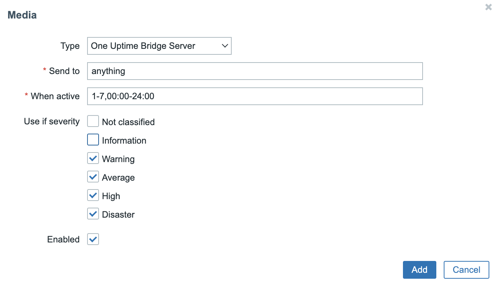
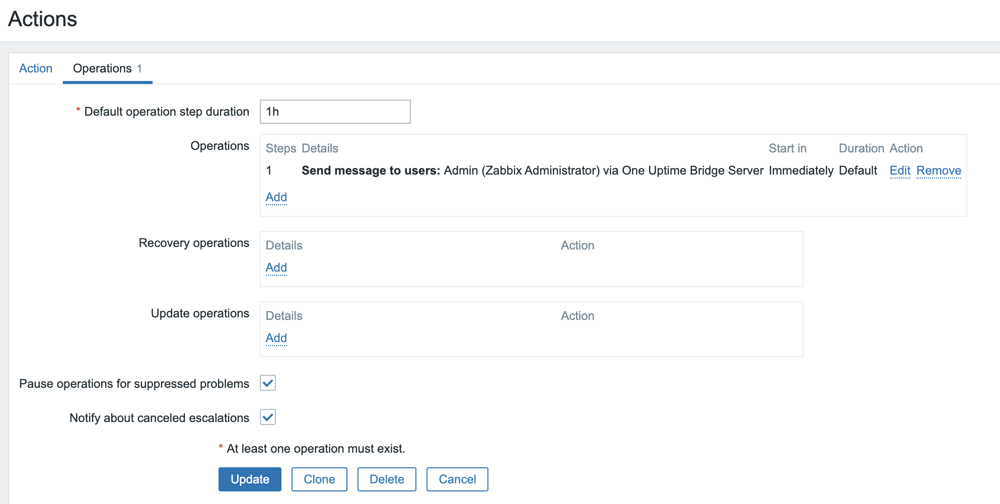
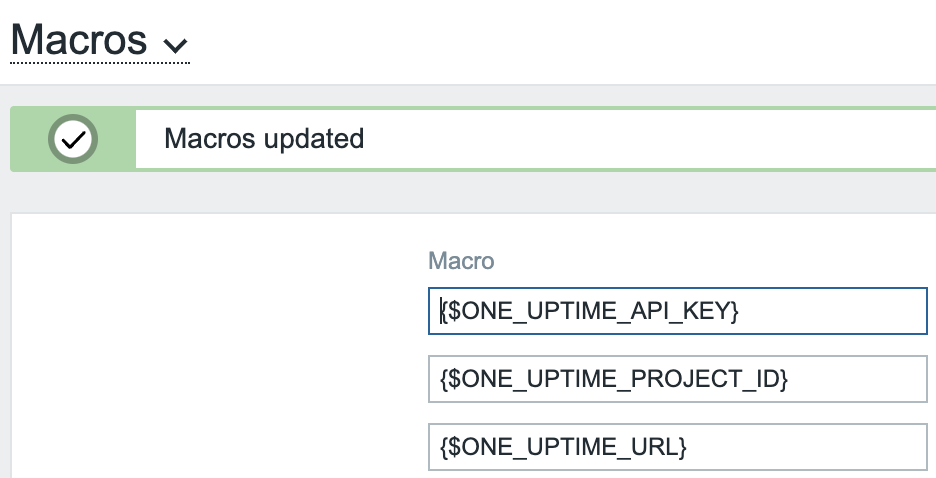

# Zabbit One Uptime Webhook Bridge

This code bridges from Zabbix triggers to One Uptime.

Allowing you to define triggers in Zabbix that create Incidents in One Uptime on pre-created monitors. You need to create the Monitors in One Uptime first and maintain a map between Zabbix trigger IDs or serverity levels and One Uptime Monitor IDs. 

> ℹ️ We use IDs instead of names so that renaming things doesn't break the production alerting system.

# Architecture

There are two parts to the system [./Zabbix%205.0/](./Zabbix%205.0/) and [./server/](./server/).

The Zabbix code is a plugin for Zabbix called a Media Type that has to be carefully configured in Zabbix

The `server` is a work in progress that may be depricated eventually.

# Configuration in Zabbix 

Zabbix can be configured to call webhooks when triggers fire. They call these `Media Types` and they are found in the Administration menu on the left in Zabbix. Triggers cause Events with can be Notified by Media Types. Webhook is a Media Type in Zabbix.

You can put raw `.js` code in Webhook Media Types.

Note that this code could be packaged up in a .json file for easy install in Zabbix's UI. See [github.com/jooola/zabbix-matrix-webhook](https://github.com/jooola/zabbix-matrix-webhook?tab=readme-ov-file#readme) for an example.

# Add a Medium on your Profile to get Alerts

> ⛔️ Note this from the docs: 
> To receive notifications of a media type, a medium (email address/phone number/webhook user ID, etc.) for this media type must be defined in the user profile. For example, an action sending messages to user "Admin" using webhook "X" will always fail to send anything if the webhook "X" medium is not defined in the user profile.

So you have to set the operation to a user who has a value setup for this Media Type on their profile. It does't matter what the value it, it isn't used by this code it just needs not to be blank/missing or Zabbix behaves as if you can't get SMS alerts because you hadn't added you phone number, etc.



# Setup Trigger Actions

You also need to add the new Media Type as a Trigger Action with an Operation. This tells Zabbix to use the Media Type to deliver Events caused by Triggers when they happen:



### Global User Macros

First add the global config as user 'macros' is Zabbix Administration -> General -> Macros:



### Add a Media Type

> ⚠️ We are thinking to have one Media Type per Event that is being forwarded. This means if someone mis-configures one event it doesn't effect other events. We need to check if the Zabbix UI can work with this.

Add a new Media Type and paste the source code into the 'script' box.

> 📋 TODO: I need to add info on which params need adding, could package that up in a YAML or JSON blob for importing.


# Local Development

# Setup

> ℹ️ Local development support has been paused as Zabbix uses a custom function to access remote APIs, `CurlHttpRequest`, which would need reimplementing. You can use the Test button in the Zabbix API.

Project ID is in One Uptime under: More -> Project Settings -> Project

Add the following in `.env`:

```
ONE_UPTIME_API_KEY=...
ONE_UPTIME_PROJECT_ID=..
ONE_UPTIME_URL=...
```

node one-password-monitor-incident.js

# Resources

1. List of [Zabbix Macros](https://www.zabbix.com/documentation/current/en/manual/appendix/macros/supported_by_location)
1. The inspiration for this project: https://github.com/jooola/zabbix-matrix-webhook?tab=readme-ov-file#readme
1. And https://www.zabbix.com/documentation/current/en/manual/xml_export_import/media#importing


# One Uptime API

Incidents: https://oneuptime.com/reference/incident

# Design

I think a Zabix trigger will map to a One Uptime incident on a monitor.

Params: 
- changeMonitorStatusTo
- remediationNotes
- rootCause
